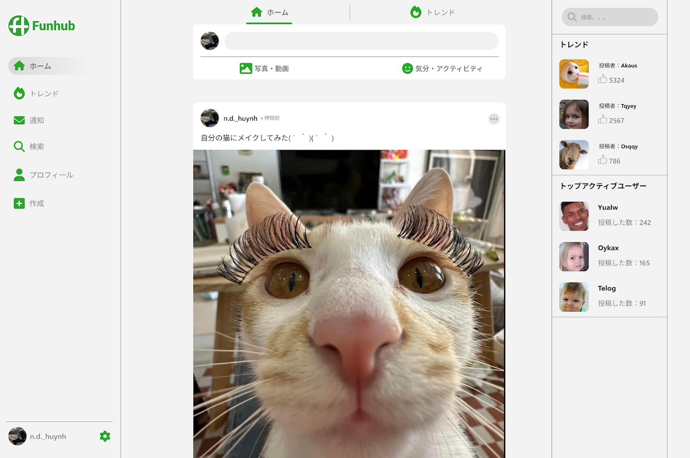

[英語版](README.en.md)

# Funhub

  

####

  

## 紹介

このプロジェクトは、JavaScript を使用したフルスタックのアプリケーションで、さまざまな技術を利用しています。

- `Node.js`
- `Express.js`
- `React.js`
- `MySQL`

## 実装された機能

このプロジェクトには、以下の機能が実装されています:

- ユーザーアカウントの作成
- ログイン機能 
- 認証機能 
- プロフィール情報の変更 
- パスワード変更機能
- 投稿機能 
- 投稿への「いいね」機能
- コメント機能 

## 前提条件

マシンに `Node.js` と `npm`がインストールされていることを確認してください。
`Node.js` のバージョン `18` を使用してください。バージョンを確認するには、`node -v` を実行します。

## インストール

1. リポジトリをクローンします：
   `git clone <https://github.com/huynhnguyen1906/FunHub.git>`

2. ルート、サーバー、およびクライアントディレクトリで依存関係をインストールします：

####

    cd <Funhub>

####

    npm install

####

    cd server

####

    npm install

####

    cd ../client

####

    npm install

3. 設定
   サーバーディレクトリに`.env.example`を`.env`にコピーし、環境変数を入力してください。
   サーバーディレクトリに `funhub-keyfile.example.json` を `funhub-keyfile.json` にコピーし、環境変数を入力してください。

## 開始方法

アプリケーションを起動するには、ルートディレクトリに戻り、次のコマンドを実行します：

    npm start

## プロジェクト構造

プロジェクトは以下の構造を持っています：

- `client/`：React クライアントアプリケーションが含まれています。
  - `src/`：React アプリケーションのソースコードが含まれています。
  - `src/components/`：再利用可能な React コンポーネントが含まれています。
  - `src/pages/`：React アプリケーションの異なるページが含まれています。
- `server/`：Node.js サーバーが含まれています。
  - `src/`：サーバーのソースコードが含まれています
  - `src/controllers/`：HTTP リクエストを処理するためのコントローラー関数が含まれています。
  - `src/models/`：データモデルが含まれています。
  - `src/routes/`: API ルートが含まれています。
  - `src/config/database`：データベースの設定が含まれています。
